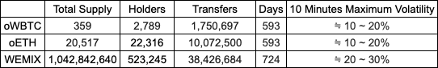
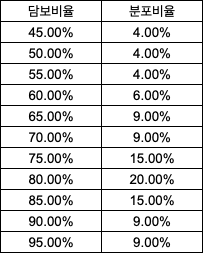

## Summary

WEMIX를 Klaybank에 Deposit, Borrow가 가능하고 담보로써도 이용가능한 자산으로 상장합니다.

## Specification

$WEMIX는 블록체인 기반 게임 생태계를 제공하는 위믹스 생태계에서 사용되는 토큰입니다. 클레이튼에서 많은 홀더들을 보유하고 있고 꾸준히 생태계를 넓히면서 $WEMIX 토큰의 사용처 또한 늘리고 있습니다.

아래에 사용된 데이터는 작성 시점인 22.06.15 기준입니다.

**Contract**

- 배포된 후 700일 이상 해킹 사례 없이 안전하게 유지되어 왔습니다.
- 이 외에 $WEMIX 토큰에 직접적인 영향을 미치는 해킹 사례는 없었습니다.

**Market**

- $WEMIX는 oWBTC, oETH보다 훨씬 많은 홀더를 보유하고 있습니다.
- 상당수의 토큰이 Dex에 유동성으로 존재하는 것이 아닌 다 디파이 컨트랙트, EOA에 존재하고 있습니다.
- 클레이튼 DEX 전체 $WEMIX 예치량은 280만 정도이며 이는 타 플랫폼에 예치된 수량에 비해 매우 부족합니다. (Kleva 1500만개, $WEMIX 스테이킹 3000만개)
- (Dex 기준) 1시간 최대 변동폭 45% 정도로 이는 ETH와 비슷한 수준입니다.
  

**Others**

- $WEMIX는 oUSDT, oWBTC, oETH등 멀티체인 토큰과 달리 클레이튼 생태계에서 시작한 토큰입니다.
- 그만큼 많은 홀더들이 보유하고 있고 위믹스 재단 또한 클레이튼에 그치지 않고 $WEMIX의 사용처를 늘리고 있습니다.

### Risk Parameters

Contract 및 Market 상황을 봤을 때 컨트랙트 취약성은 없지만 시장 위험성이 다소 존재합니다. 시장 위험성은 프로토콜의 안정성과 직결되기 때문에 그에 맞는 Risk Parameter를 설정해야합니다. 시장 위험성에서 확인한 $WEMIX는 담보가 허용되는 타 자산보다 높은 위험성을 가지고 있음을 고려합니다.

1. LP에 예치된 자산의 양
   - LP에 예치된 $WEMIX는 약 275만개 정도로 확인되었습니다.

2. 등락폭
   - 10분 기준 최대 등락폭은 약 35 ~ 45%로 확인되었습니다.

3. 목표 예치량
   - Kleva의 WEMIX 단일 예치의 약 1/3인 500만개

4. 청산 보너스
   - 시장 위험성이 존재하기 때문에 타 자산보다 높은 15%로 제시합니다.

5. 담보 비율 분포
   - $WEMIX의 최대 LTV의 N% 비율로 담보를 잡은 분포를 나타냅니다. 극단적인 상황을 가정한 분포입니다.
     

LTV가 25%, Liquidation Threshold가 30%일 때 최대 30%가 등락하면 담보잡힌 자산의 29%를 청산해야한다는 결과가 나옵니다. 이를 $WEMIX 양으로 환산하면 228,571개의 $WEMIX를 청산해야합니다.

이는 LP에 예치된 양인 275만개의 $WEMIX가 Price Impact, Liquidation Bonus를 고려했을 때 손해 없이 청산가능한 수치입니다.

위의 가정에서 프로토콜이 청산을 무리없이 해낼 수 있는 다음과 같은 Risk Parameter 수치를 제안합니다.

- LTV 25%
- Liquidation Threshold 30%
- Liquidation Bonus 15%
- Reserve Factor 40%
## Implementation
1. Set pool admin to executor
   - contract: `LendingPoolAddressesProvider`
   - method: `setPoolAdmin`
2. Init Reserve
   - contract: `LendingPoolConfigurator`
   - method: `batchInitReserve`
3. Set pool admin to 'BTokensAndRatesHelper'
   - contract: `LendingPoolAddressesProvider`
   - method: `setPoolAdmin`
4. Configure asset
   - contract: `BTokensAndRatesHelper`
   - method: `configureReserves`
5. Restore pool admin to executor
   - contract: `LendingPoolAddressesProvider`
   - method: `setPoolAdmin`