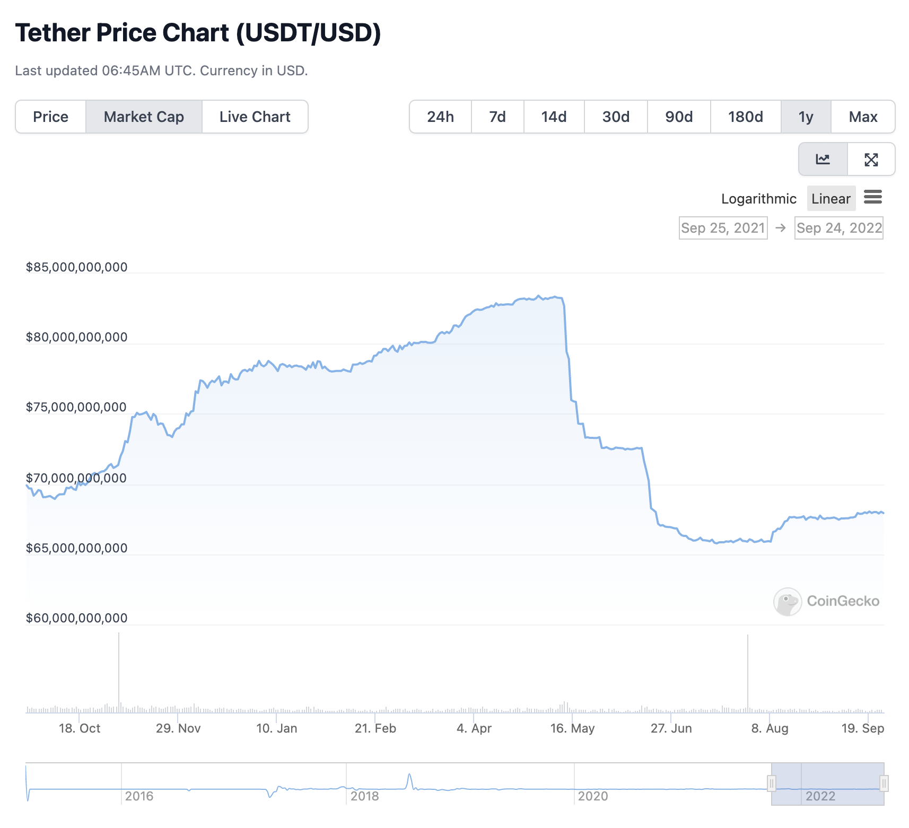
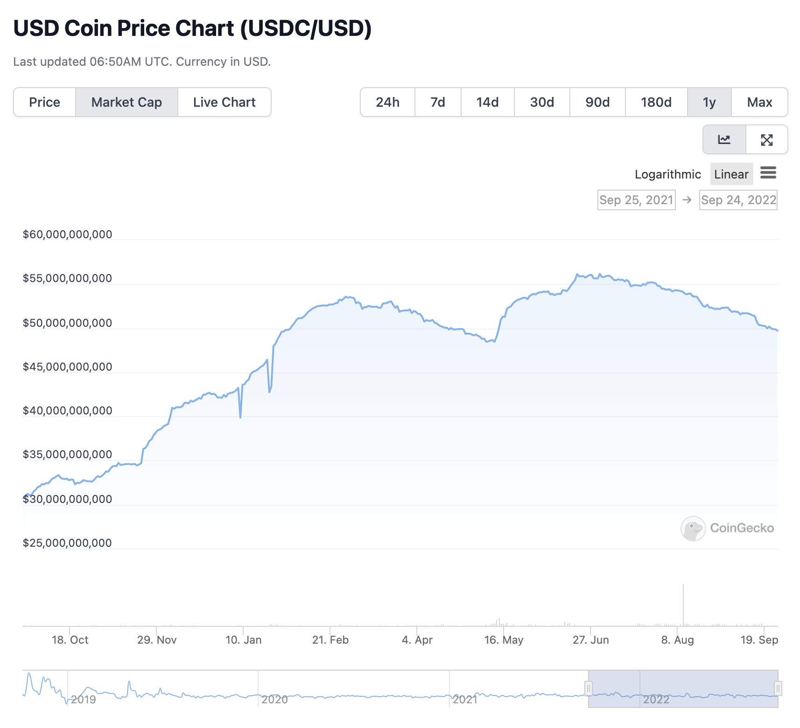

## Title

Update USDT LTV

## Summary

USDT의 LTV를 60%에서 80%로 상향 조절합니다.

## Specification

지난 테라의 LUNA, UST 이슈 이후 헤지펀드들의 USDT에 숏 베팅 등의 소식과 함께 공포감이 조성되었고 클레이뱅크 팀은 프로토콜 및 사용자들의 안전을 위해 LTV를 80%에서 60%로 하향 조절했습니다.

실제로 많은 Volume의 Stable Coin이 USDT에서 USDC로 이동했으며 현재는 볼륨 추이가 안정되었습니다.

오래전부터 존재한 테더의 뱅크런 이슈와 별개로, 테라 사태로 인한 공포감은 어느정도 해소되었다고 판단되기 때문에 USDT의 LTV를 재상향하고자 합니다.

### Risk Parameter

- LTV 60% → 80%
- Liquidation Threshold 85%
- Liquidation Bonus 10%
- Reserve Factor 15%

## Implementation

Risk Parameter를 조절합니다.
- contract: LendingPoolConfigurator
- method: configureReserveAsCollateral